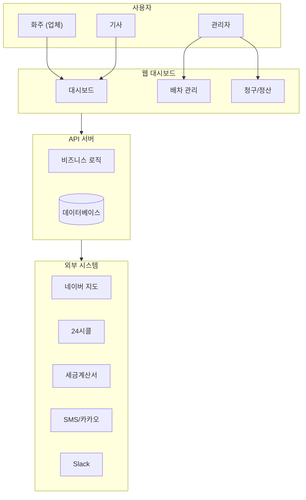
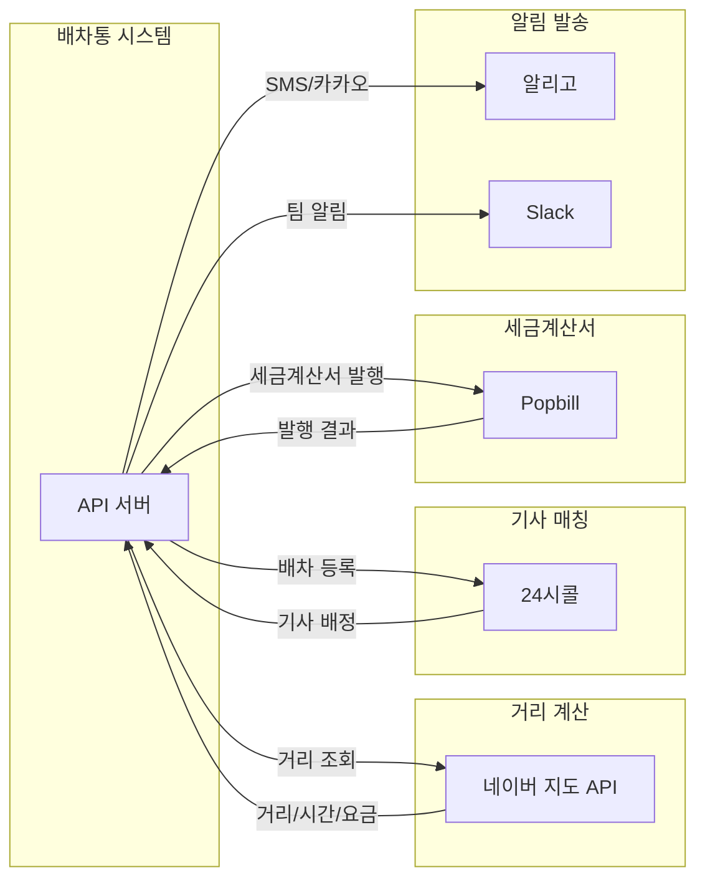
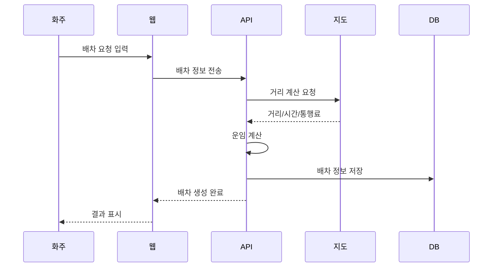
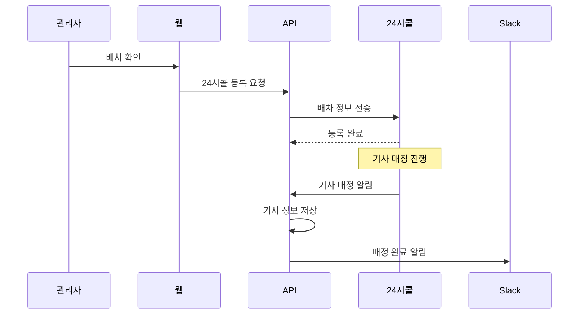
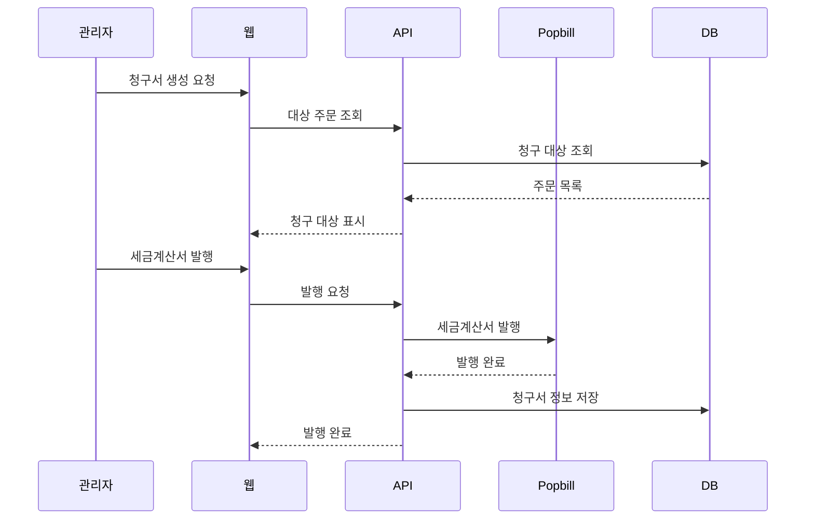

# 시스템 구조

배차통 시스템의 전체 구조와 각 구성요소를 설명합니다.

---

## 전체 시스템 구성

배차통은 **웹 대시보드**와 **API 서버**, 그리고 **외부 연동 시스템**으로 구성됩니다.

---

## 구성 요소 설명

### 1. 웹 대시보드 (Frontend)

사용자가 직접 접하는 화면입니다.

| 항목 | 설명 |
|------|------|
| **역할** | 사용자 인터페이스 제공 |
| **사용자** | 화주, 관리자, 기사 |
| **접근 방식** | 웹 브라우저 |

**주요 화면:**
- 배차 요청/관리
- 배차 내역 조회
- 청구서/정산 관리
- 거래처/기사 관리
- 각종 설정

### 2. API 서버 (Backend)

모든 데이터 처리와 비즈니스 로직을 담당합니다.

| 항목 | 설명 |
|------|------|
| **역할** | 데이터 처리, 외부 연동 |
| **데이터베이스** | PostgreSQL |
| **기반 기술** | Strapi CMS |

**주요 기능:**
- 배차 정보 저장/조회
- 운임 계산
- 청구서 생성
- 외부 시스템 연동
- 알림 발송

### 3. 데이터베이스

모든 정보가 저장되는 곳입니다.

**저장 정보:**
- 배차 정보 (주문)
- 거래처 정보
- 사용자 정보
- 기사 정보
- 청구/정산 내역
- 가격표

---

## 외부 시스템 연동

배차통은 다양한 외부 시스템과 연동하여 기능을 확장합니다.

### 연동 시스템 목록

| 시스템 | 연동 목적 | 사용 기능 |
|--------|----------|----------|
| **네이버 지도** | 거리/경로 계산 | 운임 산정, 예상 시간 |
| **24시콜** | 외부 배차 플랫폼 | 기사 매칭 확대 |
| **Popbill** | 세금계산서 | 발행, 조회, 웹훅 수신 |
| **알리고** | 알림 발송 | SMS, 카카오 알림톡 |
| **유니패스** | 통관 정보 | 수출입 화물 정보 조회 |
| **Slack** | 내부 알림 | 신규 배차, 취소 알림 |
| **AWS S3** | 파일 저장 | 이미지, 서류 저장 |

### 연동 흐름도

---

## 데이터 흐름

### 1. 배차 요청 흐름

### 2. 기사 배정 흐름

### 3. 청구/정산 흐름

---

## 시스템 특징

### 보안
- 사용자 인증 (JWT 토큰)
- 권한별 접근 제어
- 민감 정보 암호화

### 확장성
- 외부 API 연동 구조
- 모듈화된 설계

### 안정성
- 에러 추적 (Sentry)
- 자동 백업

---

## 기술 요약

| 영역 | 기술 |
|------|------|
| **프론트엔드** | React, Vite, Mantine UI |
| **백엔드** | Strapi CMS, Node.js |
| **데이터베이스** | PostgreSQL |
| **파일 저장** | AWS S3 |
| **에러 추적** | Sentry |

---

## 관련 문서

- [서비스 소개](./system-introduction.md) - 배차통이 무엇인지
- [외부 연동 기능](../04-features/integration-features.md) - 상세한 연동 설명
- [핵심 데이터 모델](../02-domain/entities.md) - 데이터 구조
