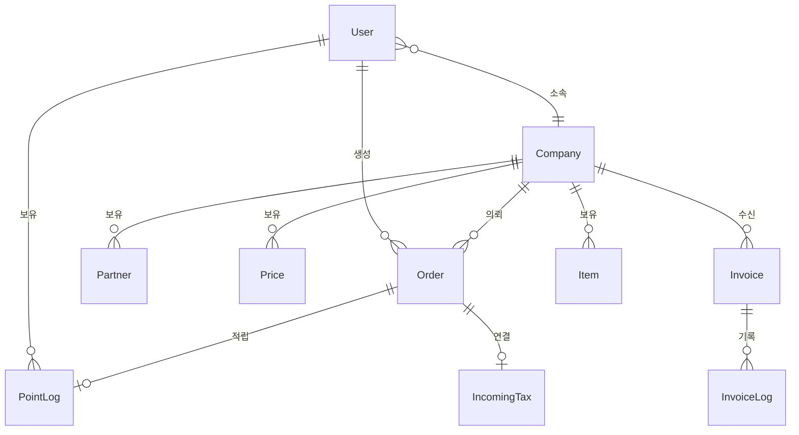
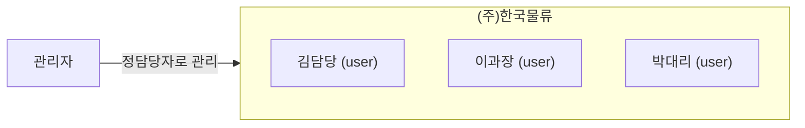
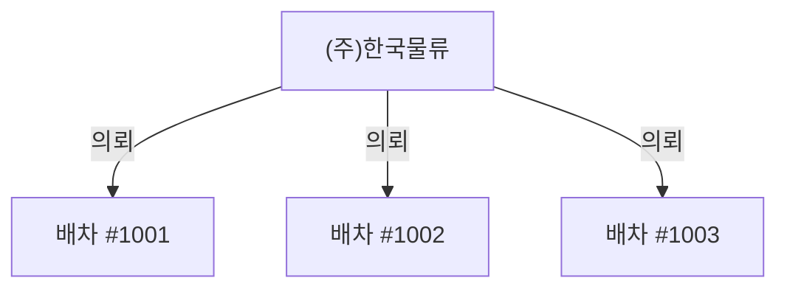
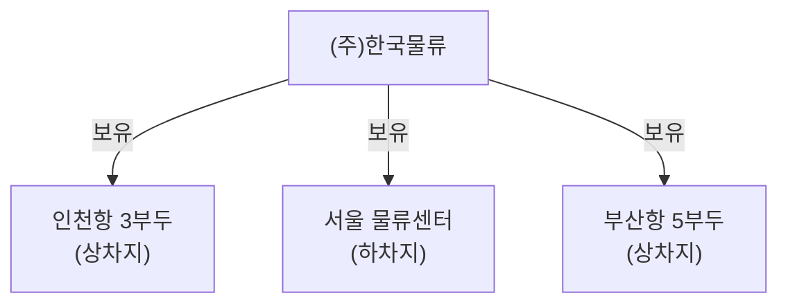
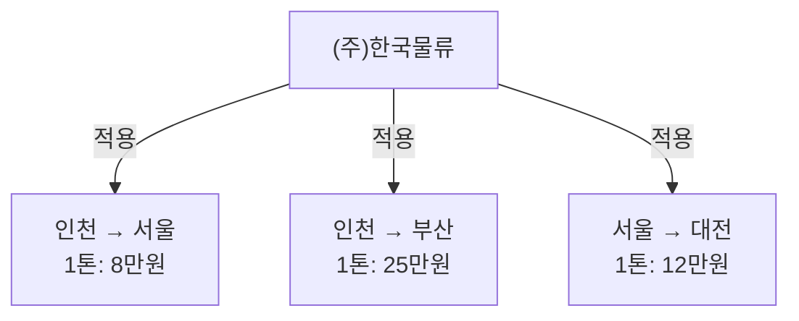
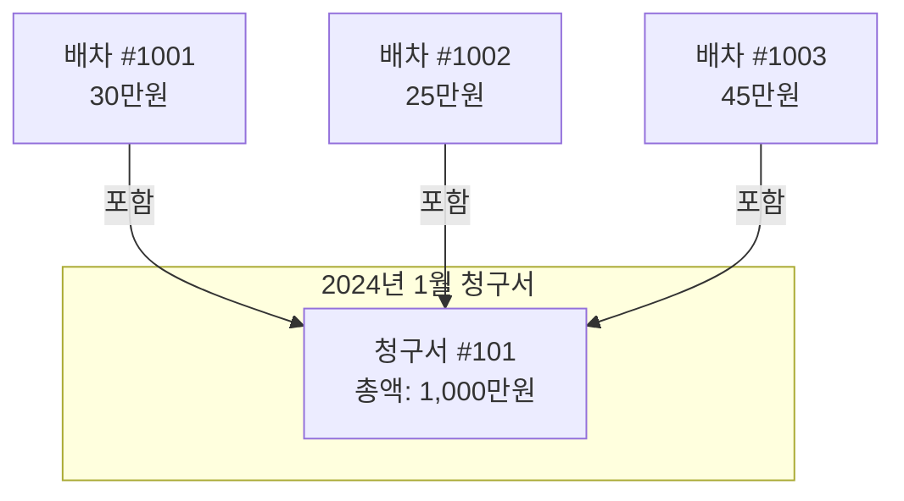
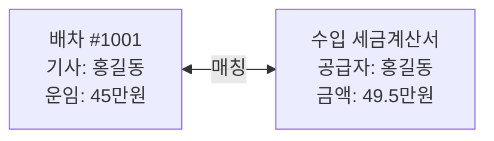
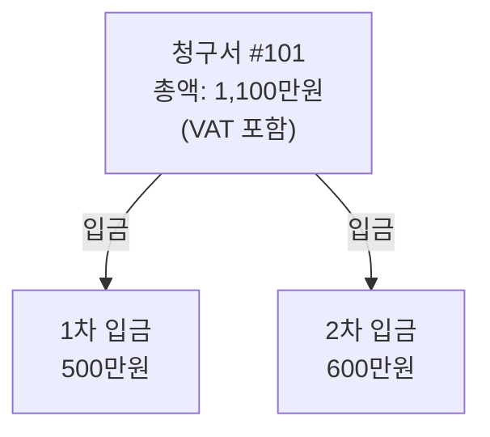
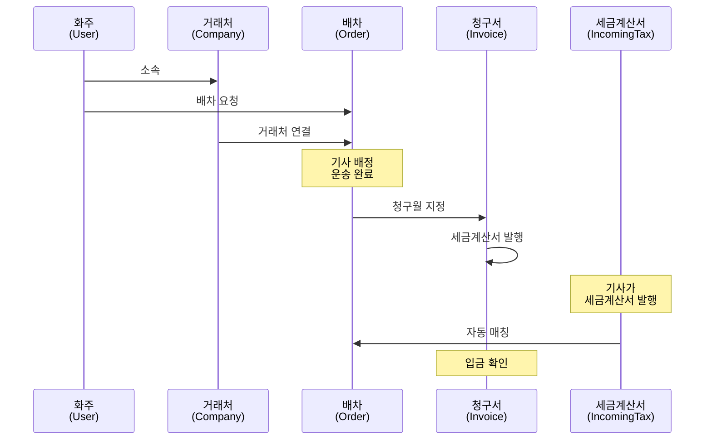

# 데이터 관계도

배차통의 핵심 데이터들이 어떻게 연결되어 있는지 설명합니다.

---

## 전체 관계도

---

## 핵심 관계 설명

### 1. 사용자 - 거래처 관계

**관계 설명:**
- 한 사용자는 **하나의 거래처**에 소속됩니다
- 한 거래처에는 **여러 사용자**가 소속될 수 있습니다
- 관리자(admin/partner/freelancer)는 여러 거래처를 담당할 수 있습니다

**실제 예시:**
> "(주)한국물류"에 김담당, 이과장, 박대리 3명이 소속
> 관리자 "홍길동"이 정담당자로 해당 거래처 관리

---

### 2. 거래처 - 배차 관계

**관계 설명:**
- 한 거래처는 **여러 배차**를 의뢰할 수 있습니다
- 한 배차는 **하나의 거래처**에 속합니다

**실제 예시:**
> "(주)한국물류"에서 1월에 50건의 배차 의뢰
> 각 배차는 해당 거래처의 거래 내역으로 집계

---

### 3. 거래처 - 상/하차지 관계

**관계 설명:**
- 한 거래처는 **여러 상/하차지**를 등록할 수 있습니다
- 상/하차지는 해당 **거래처만** 사용할 수 있습니다
- 배차 요청 시 등록된 상/하차지를 빠르게 선택 가능

**실제 예시:**
> "(주)한국물류"의 자주 사용하는 장소들을 미리 등록
> 배차 요청 시 "인천항 3부두" 선택하면 주소/연락처 자동 입력

---

### 4. 거래처 - 단가표 관계

**관계 설명:**
- 한 거래처에 **여러 구간별 단가**를 설정할 수 있습니다
- 단가표에는 차량 톤수별 운임이 포함됩니다
- 배차 요청 시 해당 구간의 단가가 자동 적용됩니다

**실제 예시:**
> "(주)한국물류"의 인천→서울 구간, 1톤 차량 운임은 80,000원
> 해당 구간 배차 요청 시 운임이 자동 계산됨

---

### 5. 배차 - 청구서 관계

**관계 설명:**
- 여러 배차가 **하나의 청구서**에 포함됩니다
- 청구서는 **월 단위**로 생성됩니다
- 배차에 청구월(billMonth)을 지정하면 해당 월 청구서에 포함

**실제 예시:**
> 1월에 완료된 30건의 배차 → 1월 청구서에 합산
> 총 운송료 1,000만원으로 세금계산서 발행

---

### 6. 배차 - 포인트 관계

**관계 설명:**
- 배차 완료 시 **포인트가 적립**될 수 있습니다
- 포인트는 해당 **사용자 계정**에 누적됩니다
- 포인트 변동 내역은 **포인트 로그**에 기록됩니다

---

### 7. 배차 - 세금계산서 관계

**관계 설명:**
- 기사가 발행한 세금계산서가 **배차와 매칭**됩니다
- 자동 매칭: 차량번호, 금액, 날짜로 자동 연결
- 수동 매칭: 관리자가 직접 연결

**실제 예시:**
> 기사 "홍길동"이 배차 #1001에 대해 세금계산서 발행
> 시스템이 차량번호와 금액으로 자동 매칭

---

### 8. 청구서 - 입금 기록 관계

**관계 설명:**
- 하나의 청구서에 **여러 번 입금**될 수 있습니다
- 각 입금은 **입금 기록(InvoiceLog)**으로 저장됩니다
- 총 입금액이 청구액에 도달하면 "입금완료" 처리

---

## 데이터 흐름 예시

### 배차 요청부터 정산까지

---

## 관련 문서

- [핵심 데이터 모델](./entities.md) - 각 데이터의 상세 정보
- [배차 워크플로우](../03-workflow/dispatch-flow.md) - 배차 처리 과정
- [청구/정산 워크플로우](../03-workflow/billing-flow.md) - 청구 처리 과정
