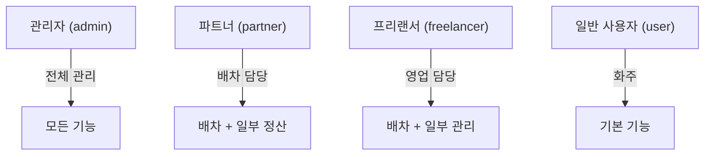

# 사용자 유형과 권한

배차통의 사용자 권한 체계를 설명합니다.

---

## 권한 체계 개요

배차통은 **4단계 권한 체계**를 사용합니다. 각 권한은 접근 가능한 기능과 데이터 범위가 다릅니다.

---

## 1. 관리자 (Admin)

시스템 전체를 관리하는 최고 권한입니다.

### 역할
- 시스템 전체 운영
- 모든 거래처 관리
- 모든 배차 처리
- 정산/청구 관리
- 사용자 계정 관리

### 접근 가능 기능

| 카테고리 | 기능 |
|----------|------|
| **배차 관리** | 배차상황실, 선착불 배차, 모든 배차 조회/수정 |
| **화주 정산** | 업체별 거래내역, 청구내역 생성, 수금관리, 미수금관리 |
| **차주 관리** | 매입 세금계산서, 지급관리, 블랙리스트 |
| **관리자 메뉴** | 계약처 관리, 사용자 관리, 마일리지, 상품권 |
| **분석** | 배차 추이, 거리별 운임, 가격 분석 |

### 특수 권한
- **회계 권한**: 특정 관리자(ID: 1, 3, 5, 87)는 추가 회계 기능 접근 가능

---

## 2. 파트너 (Partner)

배차를 담당하는 협력사 직원입니다.

### 역할
- 배차 접수 및 기사 배정
- 담당 거래처 배차 관리
- 일부 정산 업무 지원

### 접근 가능 기능

| 카테고리 | 기능 | 제한 |
|----------|------|------|
| **배차 관리** | 배차상황실 | ✓ 전체 접근 |
| **배차 관리** | 선착불 배차 | ✓ 전체 접근 |
| **차주 관리** | 블랙리스트 | ✓ 전체 접근 |
| **관리자 메뉴** | 거리별 운임 | ✓ 전체 접근 |
| **화주 정산** | 거래내역 | △ 제한적 |

### 접근 불가 기능
- 사용자 계정 관리
- 회계 관련 고급 기능
- 시스템 설정

---

## 3. 프리랜서 (Freelancer)

영업 및 배차 업무를 담당하는 외부 인력입니다.

### 역할
- 배차 접수
- 일부 관리 업무 지원

### 접근 가능 기능

| 카테고리 | 기능 | 제한 |
|----------|------|------|
| **배차 관리** | 배차상황실 | ✓ 전체 접근 |
| **화주 정산** | 일부 기능 | △ 제한적 |
| **차주 관리** | 일부 기능 | △ 제한적 |

### 접근 불가 기능
- 청구서 발행
- 세금계산서 관리
- 사용자/거래처 관리

---

## 4. 일반 사용자 (User)

화물 운송을 의뢰하는 화주 업체 직원입니다.

### 역할
- 배차 요청
- 자사 배차 내역 조회
- 청구서/거래명세서 확인

### 접근 가능 기능

| 카테고리 | 기능 |
|----------|------|
| **배차** | 신규 배차 요청 |
| **배차** | 배차 내역 조회 (자사만) |
| **정산** | 거래명세서 조회 |
| **관리** | 거래처(상/하차지) 관리 |
| **관리** | 상차품 관리 |
| **계정** | 내 회사 정보 관리 |
| **마일리지** | 포인트 조회/출금 |

### 접근 불가 기능
- 다른 업체의 배차 조회
- 기사 정보 관리
- 가격 분석

---

## 권한별 메뉴 비교

### 배차 관련

| 메뉴 | Admin | Partner | Freelancer | User |
|------|:-----:|:-------:|:----------:|:----:|
| 신규 배차 요청 | ✓ | ✓ | ✓ | ✓ |
| 배차상황실 | ✓ | ✓ | ✓ | - |
| 선착불 배차 | ✓ | ✓ | - | - |
| 배차 내역 (전체) | ✓ | ✓ | ✓ | - |
| 배차 내역 (자사) | - | - | - | ✓ |

### 정산 관련

| 메뉴 | Admin | Partner | Freelancer | User |
|------|:-----:|:-------:|:----------:|:----:|
| 업체별 거래내역 | ✓ | △ | △ | - |
| 청구내역 생성 | ✓ | - | - | - |
| 수금/미수금 관리 | ✓ | - | - | - |
| 매출 세금계산서 | ✓ | - | - | - |
| 거래명세서 조회 | - | - | - | ✓ |

### 관리 메뉴

| 메뉴 | Admin | Partner | Freelancer | User |
|------|:-----:|:-------:|:----------:|:----:|
| 계약처(거래처) 관리 | ✓ | - | - | - |
| 사용자 계정 관리 | ✓ | - | - | - |
| 기사 블랙리스트 | ✓ | ✓ | - | - |
| 마일리지 내역 | ✓ | - | - | ✓* |
| 상품권 설정 | ✓ | - | - | - |

*User는 자신의 마일리지만 조회 가능

### 분석 기능

| 메뉴 | Admin | Partner | Freelancer | User |
|------|:-----:|:-------:|:----------:|:----:|
| 배차 추이 분석 | ✓ | - | - | - |
| 거리별 운임 단가 | ✓ | ✓ | - | - |
| 가격 분석 | ✓ | - | - | - |

---

## 데이터 접근 범위

### 배차 데이터

| 권한 | 접근 범위 |
|------|----------|
| Admin | 모든 배차 |
| Partner | 모든 배차 |
| Freelancer | 모든 배차 |
| User | 자사 배차만 |

### 거래처 데이터

| 권한 | 접근 범위 |
|------|----------|
| Admin | 모든 거래처 |
| Partner | 담당 거래처 |
| Freelancer | 담당 거래처 |
| User | 자사만 |

### 정산 데이터

| 권한 | 접근 범위 |
|------|----------|
| Admin | 모든 정산 |
| Partner | 담당 거래처 일부 |
| Freelancer | 제한적 |
| User | 자사 청구서만 |

---

## 담당자 체계

### 정담당자 vs 부담당자

거래처에는 담당자가 배정됩니다:

| 구분 | 역할 |
|------|------|
| **정담당자 (Manager)** | 해당 거래처의 주 담당자. 모든 업무 책임 |
| **부담당자 (Partner)** | 보조 담당자. 정담당자 부재 시 대응 |

### 담당자 기준 필터링

배차 분석 시 담당자별 실적을 조회할 수 있습니다:

- **정담당자 기준**: 해당 관리자가 정담당인 거래처의 배차
- **부담당자 기준**: 해당 관리자가 부담당인 거래처의 배차
- **실제 배차자 기준**: 실제로 배차를 처리한 담당자

---

## 권한 변경

### 권한 부여/변경
- **Admin**만 사용자 권한 변경 가능
- 사용자 계정 관리 메뉴에서 처리

### 신규 사용자
- 회원가입 시 기본 권한: **user**
- 관리자가 권한 승격 필요

---

## 관련 문서

- [핵심 데이터 모델](./entities.md) - 사용자 데이터 구조
- [관리자 기능](../04-features/admin-features.md) - 관리자 전용 기능
- [화주 기능](../04-features/user-features.md) - 일반 사용자 기능
