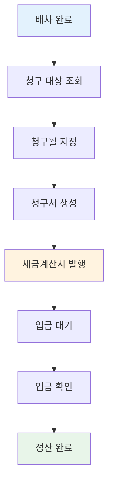
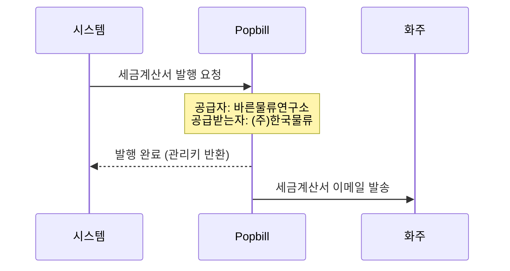
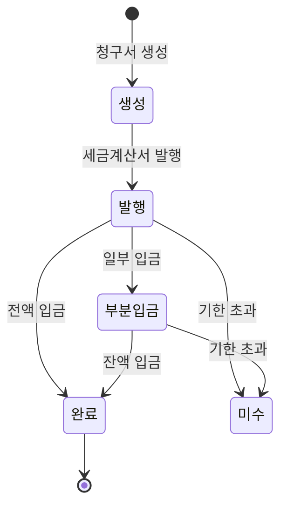

# 청구/정산 워크플로우

화주에게 운송 비용을 청구하는 과정을 설명합니다.

---

## 청구 프로세스 개요



---

## 단계별 상세 설명

### 1단계: 청구 대상 조회

**목적**: 아직 청구되지 않은 배차 건을 확인합니다.

**조회 조건**:
- 상태: 정산중(accounting) 이상
- 청구월: 미지정 (null)
- 기간: 특정 기간 내 완료 건

**조회 결과**:

| 거래처 | 배차 건수 | 총 운송료 |
|--------|:--------:|----------:|
| (주)한국물류 | 25건 | 5,000,000원 |
| (주)대한운송 | 15건 | 3,200,000원 |
| ... | ... | ... |

---

### 2단계: 청구월 지정

**목적**: 배차 건에 청구월을 배정합니다.

**작업 내용**:
- 청구 대상 배차 선택
- 청구월 지정 (예: 2024-01)
- 일괄 업데이트

**예시**:
```
배차 #1001, #1002, #1003 → 청구월: 2024-01
```

**청구월 지정 후**:
- 해당 배차들이 해당 월의 청구서에 포함될 준비 완료
- 청구서가 생성되기 전까지 수정 가능

---

### 3단계: 청구서 생성

**목적**: 월별 청구서(Invoice)를 생성합니다.

**청구서 내용**:

| 항목 | 내용 |
|------|------|
| 거래처 | (주)한국물류 |
| 청구월 | 2024년 1월 |
| 배차 목록 | 배차 #1001, #1002, ... (25건) |
| 공급가 | 5,000,000원 |
| 부가세 | 500,000원 |
| 합계 | 5,500,000원 |

---

### 4단계: 세금계산서 발행

**목적**: 법적 증빙을 위한 전자세금계산서를 발행합니다.



**발행 정보**:
- 공급자: 바른물류연구소
- 공급받는자: 해당 거래처
- 작성일자, 공급가액, 세액
- 국세청 확인번호 발급

---

### 5단계: 입금 대기

**목적**: 화주의 입금을 기다립니다.

**입금 상태 관리**:

| 상태 | 설명 |
|------|------|
| 입금전 | 세금계산서 발행됨, 입금 대기 |
| 부분입금 | 일부 금액만 입금됨 |
| 완료 | 전액 입금됨 |
| 미수 | 입금 기한 초과 |

---

### 6단계: 입금 확인

**목적**: 입금 내역을 확인하고 기록합니다.

**입금 기록 (InvoiceLog)**:

| 항목 | 내용 |
|------|------|
| 청구서 | 청구서 #101 |
| 입금일 | 2024-02-10 |
| 입금액 | 5,500,000원 |
| DSO | 15일 (청구 후 입금까지 소요일) |

---

### 7단계: 정산 완료

**목적**: 청구/정산 처리를 마무리합니다.

**완료 처리**:
- 청구서 상태: 완료
- 포함된 배차들: 정산 완료 처리

---

## 청구서 상태 흐름



---

## 청구 상태 분류

### 배차 기준 청구 상태

| 상태 | 조건 | 설명 |
|------|------|------|
| 미청구 | 청구월 = null | 아직 청구월 미지정 |
| 청구전 | 청구월 ≠ null, 관리키 = null | 청구월 지정됨, 세금계산서 미발행 |
| 입금전 | 관리키 ≠ null, 입금 = false | 세금계산서 발행됨, 입금 대기 |
| 완료 | 입금 = true | 입금 확인됨 |
| 미수 | 입금기한 < 오늘, 입금 = false | 입금 기한 초과 |

---

## 거래명세서

### 화주 조회용

화주(일반 사용자)는 자사의 거래명세서를 조회할 수 있습니다.

**조회 내용**:
- 월별 배차 목록
- 각 배차의 상세 정보
- 총 금액 합계

**상태별 필터**:
- 전체
- 청구전
- 입금전
- 완료
- 미수

---

## 미수금 관리

### 미수금 정의

- 세금계산서가 발행되었으나
- 입금 기한이 지났고
- 아직 입금되지 않은 금액

### 미수금 조회

| 거래처 | 청구월 | 청구액 | 미수액 | 경과일 |
|--------|--------|-------:|-------:|-------:|
| (주)한국물류 | 2024-01 | 5,500,000원 | 5,500,000원 | 30일 |
| (주)대한운송 | 2024-01 | 3,520,000원 | 1,000,000원 | 25일 |

### 미수금 처리

1. 담당자 연락
2. 추가 입금 기한 협의
3. 부분 입금 처리
4. 완료 처리

---

## 세금계산서 유형

### 매출 세금계산서 (발행)

- 배차통 → 화주
- 운송 서비스 제공에 대한 대금 청구
- Popbill을 통해 발행

### 매입 세금계산서 (수신)

- 기사 → 배차통
- 기사 운임에 대한 세금계산서
- 배차와 자동/수동 매칭

---

## 관련 문서

- [기사 지급 워크플로우](./payment-flow.md) - 기사 정산
- [배차 워크플로우](./dispatch-flow.md) - 배차 처리 과정
- [외부 연동 기능](../04-features/integration-features.md) - Popbill 연동
- [관리자 기능](../04-features/admin-features.md) - 청구 관리 기능
