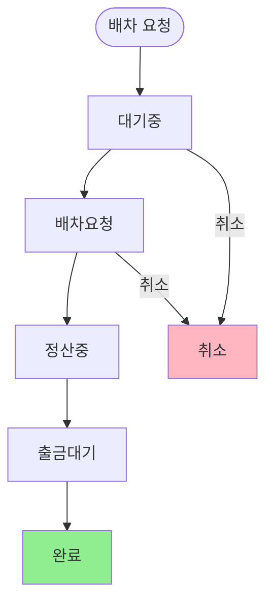
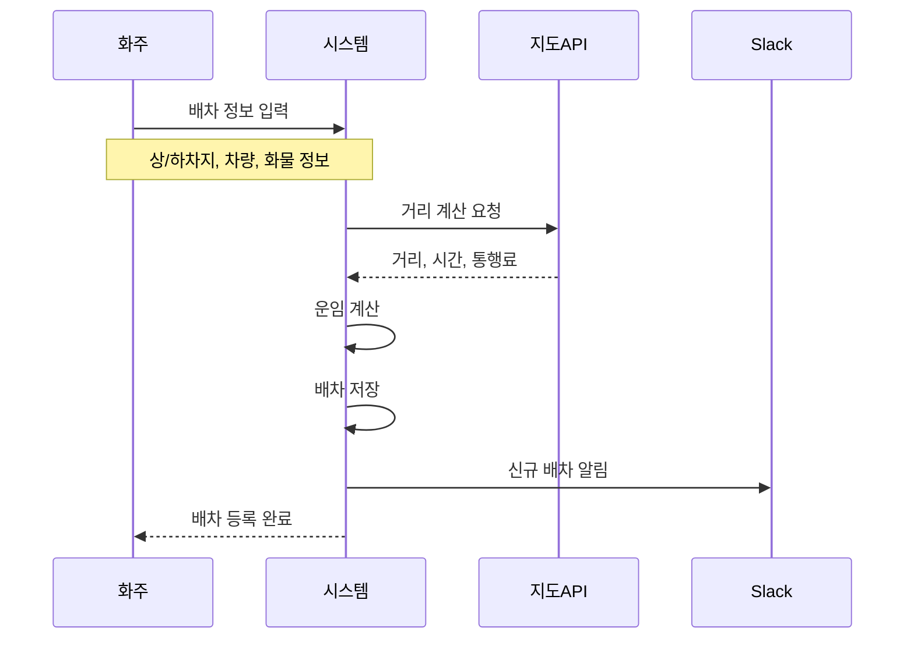
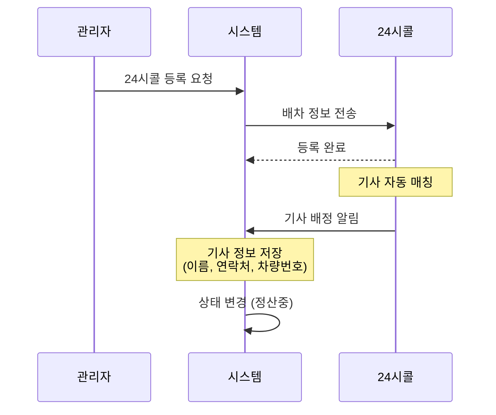
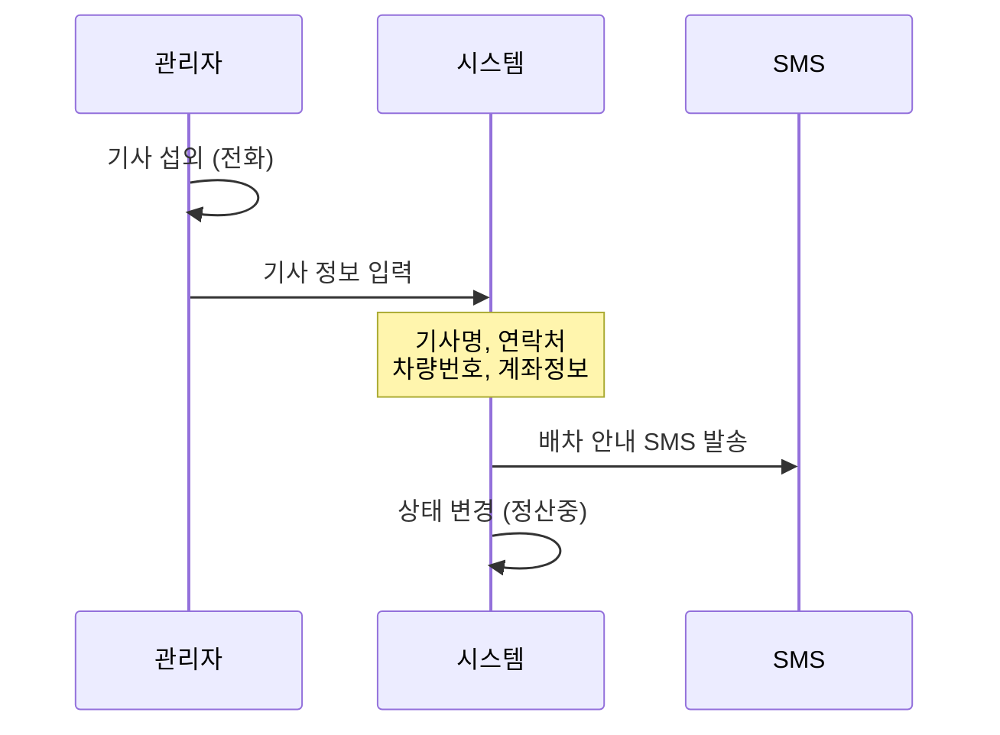
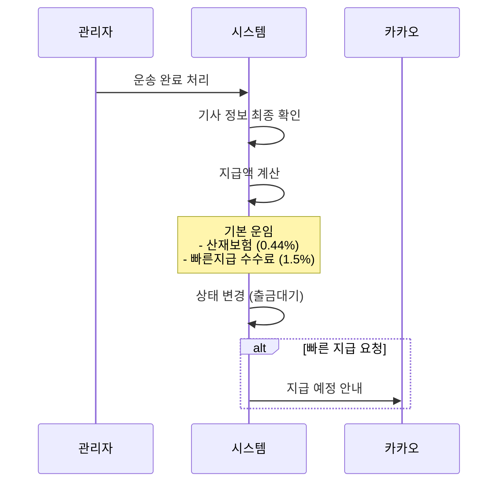

# 배차 워크플로우

배차 요청부터 완료까지의 전체 과정을 설명합니다.

---

## 배차 생명주기

배차는 다음 단계를 거쳐 처리됩니다:

---

## 상태별 설명

### 1. 대기중 (pending)

**언제**: 배차가 처음 생성된 직후

**상태 설명**:
- 화주가 배차를 요청했으나 아직 처리 전
- 관리자가 내용을 검토 중
- 기사 배정이 시작되지 않음

**다음 단계**:
- 관리자가 확인 후 → **배차요청** 상태로 변경
- 취소가 필요한 경우 → **취소** 상태로 변경

---

### 2. 배차요청 (requested)

**언제**: 관리자가 기사 배정을 시작할 때

**상태 설명**:
- 기사를 찾는 중
- 24시콜에 등록되어 자동 매칭 대기 중
- 또는 관리자가 수동으로 기사를 찾는 중

**주요 활동**:
- 24시콜을 통한 자동 기사 매칭
- 관리자의 직접 기사 섭외
- 기사 정보 입력 (이름, 연락처, 차량번호)

**다음 단계**:
- 기사 배정 완료, 운송 시작 → **정산중** 상태로 변경
- 취소가 필요한 경우 → **취소** 상태로 변경

---

### 3. 정산중 (accounting)

**언제**: 기사가 배정되어 운송이 진행/완료된 후

**상태 설명**:
- 기사가 화물을 수령하여 운송 중 또는 완료
- 기사 운임 정산을 위한 정보 확인 중
- 세금계산서 처리 대기

**주요 활동**:
- 기사 정보 최종 확인 (계좌정보 등)
- 기사 운임 확정
- 청구월 지정

**다음 단계**:
- 기사 지급 처리 시작 → **출금대기** 상태로 변경

---

### 4. 출금대기 (withdraw)

**언제**: 기사에게 운임을 지급하기 직전

**상태 설명**:
- 기사 운임 지급 처리 대기 중
- 지급 예정일 확정됨
- 빠른 지급 요청 시 수수료 적용

**주요 활동**:
- 지급 예정일 설정
- 공제 금액 계산 (산재보험, 빠른지급 수수료)
- 기사에게 카카오톡 알림 발송

**다음 단계**:
- 지급 완료 → **완료** 상태로 변경

---

### 5. 완료 (finished)

**언제**: 모든 처리가 끝났을 때

**상태 설명**:
- 운송 완료
- 기사 운임 지급 완료
- 화주 청구 처리 중 또는 완료

**최종 상태**:
- 이후 상태 변경 없음
- 청구서에 포함되어 화주에게 청구됨

---

### 취소 (canceled)

**언제**: 배차가 취소되었을 때

**취소 가능 시점**:
- 대기중 상태에서 취소
- 배차요청 상태에서 취소

**취소 불가 시점**:
- 정산중 이후에는 취소 불가
- 이미 기사 운임이 지급되었거나 청구된 경우

---

## 상세 프로세스

### 배차 요청 과정

**배차 요청 시 입력 정보**:

| 구분 | 필수 정보 | 선택 정보 |
|------|----------|----------|
| **출발** | 상차지명, 주소, 연락처, 상차일시 | 상세주소, 메모 |
| **도착** | 하차지명, 주소, 연락처, 하차일시 | 상세주소, 메모 |
| **화물** | 상차품명 | 무게, 이미지 |
| **차량** | 차량 종류, 톤수 | 상/하차 방법 |
| **옵션** | - | 왕복, 혼적, 인수증 필요 |

---

### 기사 배정 과정

#### 방법 1: 24시콜 자동 매칭

#### 방법 2: 수동 배정

---

### 운송 완료 처리

---

## 배차 상태 요약

| 상태 | 영문 | 설명 | 취소 가능 |
|------|------|------|:--------:|
| 대기중 | pending | 배차 생성됨, 처리 전 | ✓ |
| 배차요청 | requested | 기사 배정 진행 중 | ✓ |
| 정산중 | accounting | 운송 완료, 정산 처리 중 | ✗ |
| 출금대기 | withdraw | 기사 지급 대기 | ✗ |
| 완료 | finished | 모든 처리 완료 | ✗ |
| 취소 | canceled | 배차 취소됨 | - |

---

## 특수 배차 유형

### 선착불 배차

일반 배차와 다른 정산 방식을 사용하는 배차입니다.

| 상태 | 설명 |
|------|------|
| feeRequested | 선착불 배차 요청 |
| feeFinished | 선착불 배차 완료 |
| feeCanceled | 선착불 배차 취소 |

### 수수료 배차

별도의 수수료 처리가 필요한 경우 사용합니다.

---

## 알림 발송 시점

| 시점 | 알림 채널 | 수신자 | 내용 |
|------|----------|--------|------|
| 배차 생성 | Slack | 관리자 | 신규 배차 알림 |
| 배차 취소 | Slack | 관리자 | 취소 알림 |
| 기사 배정 | SMS | 기사 | 배차 안내 |
| 지급 예정 | 카카오톡 | 기사 | 지급 예정일, 금액 |

---

## 관련 문서

- [청구/정산 워크플로우](./billing-flow.md) - 청구 처리 과정
- [기사 지급 워크플로우](./payment-flow.md) - 기사 운임 정산
- [알림 체계](./notification-flow.md) - 알림 상세
- [핵심 데이터 모델](../02-domain/entities.md) - 배차 데이터 구조
