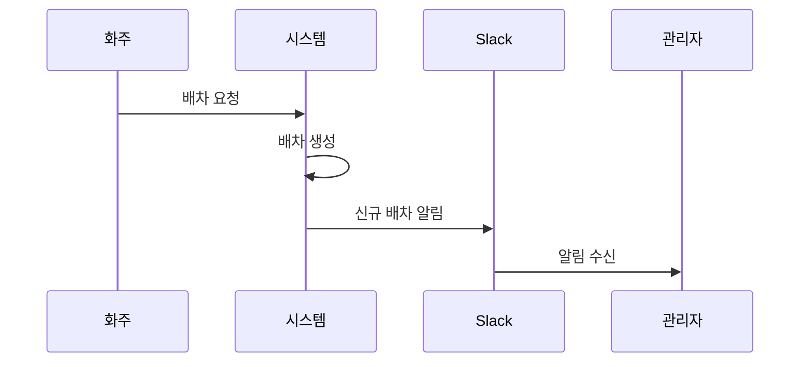
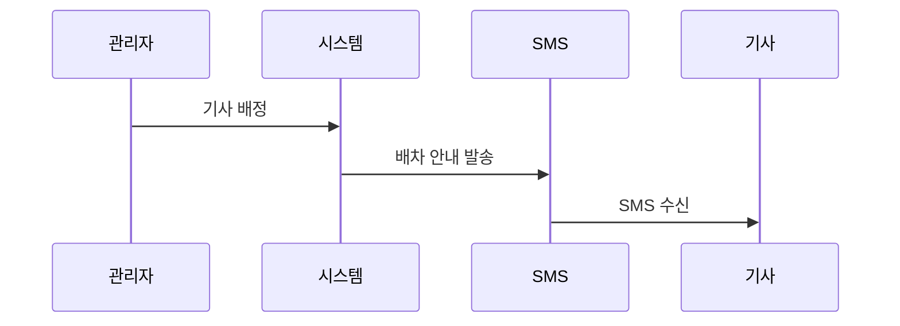
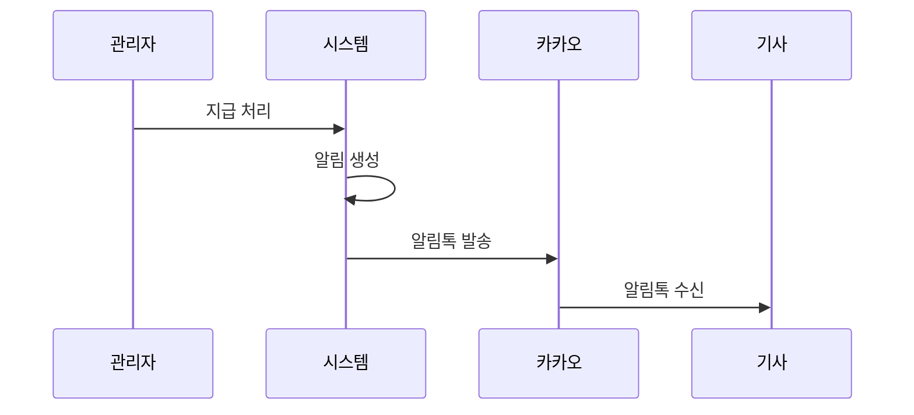

# 알림 체계

배차통에서 발송되는 각종 알림을 설명합니다.

---

## 알림 채널

배차통은 3가지 알림 채널을 사용합니다:

| 채널 | 대상 | 용도 |
|------|------|------|
| **Slack** | 내부 관리자 | 업무 알림 (신규 배차, 취소 등) |
| **SMS** | 기사 | 배차 안내 |
| **카카오 알림톡** | 기사 | 지급 예정 안내 |

---

## Slack 알림

### 발송 시점

| 이벤트 | 채널 | 내용 |
|--------|------|------|
| 신규 배차 | 신규오더 채널 | 새 배차 등록 알림 |
| 배차 취소 | 취소 채널 | 배차 취소 알림 |
| 빠른 지급 요청 | 지급 채널 | 익일 지급 요청 알림 |

### 신규 배차 알림 예시

```
🚛 새 배차가 등록되었습니다

배차번호: #1001
거래처: (주)한국물류

📍 상차지: 인천항 3부두
📍 하차지: 서울 강남구

📅 상차: 2024-01-15 09:00 (당상)
📅 하차: 2024-01-15 14:00 (당착)

🚚 차량: 5톤 윙바디
💰 운송료: 500,000원

담당자: 홍길동
```

### 배차 취소 알림 예시

```
❌ 배차가 취소되었습니다

배차번호: #1001
거래처: (주)한국물류
취소 사유: 화주 요청
```

---

## SMS 알림

### 발송 시점

| 이벤트 | 수신자 | 내용 |
|--------|--------|------|
| 기사 배정 | 기사 | 배차 정보 안내 |
| 배차 변경 | 기사 | 변경 내용 안내 |

### 기사 배정 SMS 예시

```
[바른물류연구소]
배차가 배정되었습니다.

상차: 인천항 3부두
하차: 서울 강남구
상차일시: 01/15 09:00

문의: 02-1234-5678
```

### SMS 발송 시스템

- 서비스: 알리고 (Aligo)
- 발신번호: 바른물류연구소 대표번호

---

## 카카오 알림톡

### 발송 시점

| 이벤트 | 수신자 | 내용 |
|--------|--------|------|
| 지급 예정 확정 | 기사 | 지급 예정일, 금액, 계좌 |

### 지급 예정 알림톡 예시

```
[지급 예정 안내]

안녕하세요, 홍길동님

입금예정일: 2024-01-20
운송비(VAT포함): 550,000원
산재보험공제: -2,200원
빠른지급수수료: -8,250원
─────────────────
실수령액: 539,550원

입금계좌: 국민은행 123-456-78901234

배차정보:
- 01/15 인천항→서울 (5톤)

감사합니다.
```

### 알림톡 템플릿

| 템플릿 코드 | 용도 |
|------------|------|
| TS_7744 | 지급 예정 안내 |

### 알림톡 발송 시스템

- 서비스: 알리고 카카오 API
- 발신 프로필: 바른물류연구소

---

## 알림 흐름도

### 배차 생성 시



### 기사 배정 시



### 지급 예정 시



---

## 알림 설정

### 시스템 알림 (Slack)

| 설정 | 설명 |
|------|------|
| 웹훅 URL | Slack 채널별 웹훅 URL |
| 채널 | 신규오더, 취소, 지급 등 채널 분리 |

### 고객 알림 (SMS/카카오)

| 설정 | 설명 |
|------|------|
| 발신번호 | 대표 전화번호 |
| API 키 | 알리고 API 인증 키 |
| 발신 프로필 | 카카오 비즈니스 프로필 |

---

## 알림 내역 관리

### 알림 엔티티 (Notification)

| 필드 | 설명 |
|------|------|
| 이름 | 알림 제목 |
| 유형 | 알림 종류 (quick-payment 등) |
| 내용 | 알림 본문 |
| 완료 여부 | 처리 상태 |
| 관련 배차 | 연결된 배차 |
| 요청 사용자 | 알림을 트리거한 사용자 |
| 요청 거래처 | 관련 거래처 |

### 알림 조회

- 관리자는 "알림센터"에서 알림 내역 조회 가능
- 처리 완료 여부 확인
- 알림 상세 내용 확인

---

## 알림 발송 실패 처리

### 실패 원인

| 채널 | 실패 원인 |
|------|----------|
| Slack | 웹훅 URL 오류, 네트워크 오류 |
| SMS | 잘못된 번호, 수신 거부, 잔액 부족 |
| 카카오 | 수신 차단, 친구 미추가, API 오류 |

### 재시도 정책

- 자동 재시도 없음
- 실패 시 로그 기록
- 관리자가 수동으로 재발송 가능

---

## 관련 문서

- [배차 워크플로우](./dispatch-flow.md) - 배차 처리 과정
- [기사 지급 워크플로우](./payment-flow.md) - 지급 알림 상세
- [외부 연동 기능](../04-features/integration-features.md) - 알리고 연동
