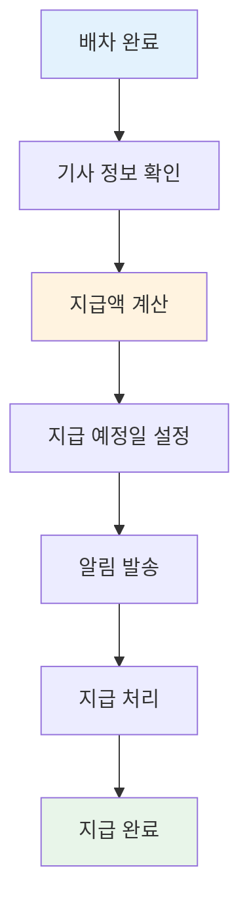
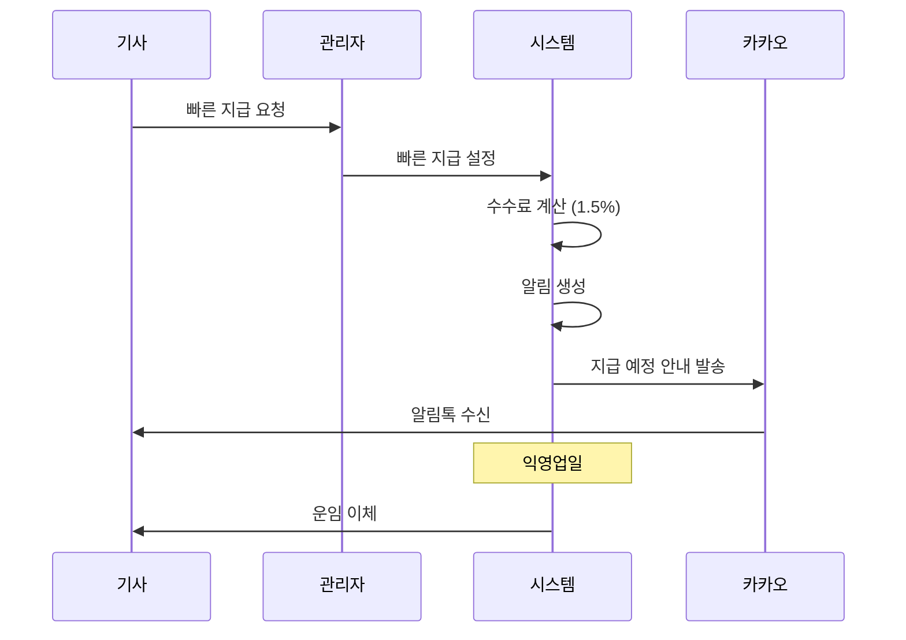

# 기사 지급 워크플로우

기사에게 운임을 정산하고 지급하는 과정을 설명합니다.

---

## 정산 프로세스 개요



---

## 단계별 상세 설명

### 1단계: 배차 완료

운송이 완료되고 기사 정보가 확정됩니다.

**확정 정보**:
- 기사명
- 기사 연락처
- 차량 번호
- 기사 운임

---

### 2단계: 기사 정보 확인

기사 계좌 정보를 확인합니다.

**필요 정보**:

| 항목 | 예시 |
|------|------|
| 은행명 | 국민은행 |
| 계좌번호 | 123-456-78901234 |
| 예금주 | 홍길동 |
| 사업자번호 | 123-45-67890 (선택) |

---

### 3단계: 지급액 계산

공제 항목을 적용하여 실 지급액을 계산합니다.

#### 기본 계산

```
기본 운임 = 기사 운임 - 기사 추가비용
부가세 포함 금액 = 기본 운임 × 1.1
```

#### 공제 항목

| 항목 | 계산 방식 | 설명 |
|------|----------|------|
| 산재보험 | 기본 운임 × 0.501% × 0.88% | 산재보험료 공제 |
| 빠른 지급 수수료 | 부가세 포함 × 1.5% | 익일 지급 선택 시 |

#### 계산 예시

```
기사 운임: 500,000원
추가비용: 0원
---
기본 운임: 500,000원
부가세 포함: 550,000원 (500,000 × 1.1)

공제 항목:
- 산재보험: 2,200원 (500,000 × 0.501% × 0.88%, 10원 단위 절사)
- 빠른 지급 수수료: 8,250원 (550,000 × 1.5%, 빠른 지급 시)
---
실 지급액 (일반): 547,800원
실 지급액 (빠른 지급): 539,550원
```

---

### 4단계: 지급 예정일 설정

기사에게 운임을 지급할 날짜를 설정합니다.

**지급 유형**:

| 유형 | 설명 | 수수료 |
|------|------|--------|
| 일반 지급 | 정해진 정산일에 지급 | 없음 |
| 빠른 지급 | 익일 (영업일 기준) 지급 | 1.5% |

---

### 5단계: 알림 발송

기사에게 지급 예정 정보를 알립니다.

#### 카카오톡 알림 내용

```
[지급 예정 안내]

안녕하세요, 홍길동님

입금예정일: 2024-01-20
운송비(VAT포함): 550,000원
산재보험공제: -2,200원
빠른지급수수료: -8,250원
─────────────────
실수령액: 539,550원

입금계좌: 국민은행 123-456-78901234

감사합니다.
```

---

### 6단계: 지급 처리

설정된 날짜에 기사 계좌로 운임을 이체합니다.

**지급 처리**:
- 일괄 지급 목록 생성
- 은행 이체 처리
- 지급 완료 확인

---

### 7단계: 지급 완료

지급이 완료되고 배차 상태가 업데이트됩니다.

**완료 처리**:
- 배차 상태: 완료 (finished)
- 지급 완료일 기록

---

## 빠른 지급 상세

### 빠른 지급이란?

기사가 정상 정산일보다 빨리 운임을 받고 싶을 때 사용하는 서비스입니다.

### 프로세스



### 수수료 계산

```
빠른 지급 수수료 = 부가세 포함 금액 × 1.5%

예: 550,000원 × 1.5% = 8,250원
```

---

## 세금계산서 매칭

### 수입 세금계산서 (매입)

기사가 발행한 세금계산서를 배차와 연결합니다.

#### 자동 매칭

시스템이 다음 정보로 자동 매칭을 시도합니다:
- 차량 번호
- 금액 (오차 범위 내)
- 날짜

#### 매칭 상태

| 상태 | 설명 |
|------|------|
| 대기 (pending) | 매칭 처리 대기 |
| 자동매칭 (automatch) | 시스템이 자동 연결 |
| 검토필요 (review) | 수동 확인 필요 |
| 승인 (approved) | 매칭 확정 |
| 거절 (declined) | 매칭 거절 |

---

## 지급 관리 화면

### 기사별 지급 현황

| 기사명 | 차량번호 | 배차건수 | 지급 예정액 | 지급 예정일 |
|--------|----------|:--------:|----------:|------------|
| 홍길동 | 12가3456 | 5건 | 2,500,000원 | 2024-01-20 |
| 김철수 | 34나5678 | 3건 | 1,800,000원 | 2024-01-20 |

### 일괄 처리

- 지급 예정일 기준으로 일괄 조회
- 지급 목록 엑셀 다운로드
- 일괄 완료 처리

---

## 관련 문서

- [배차 워크플로우](./dispatch-flow.md) - 배차 처리 과정
- [청구/정산 워크플로우](./billing-flow.md) - 화주 청구 과정
- [알림 체계](./notification-flow.md) - 카카오톡 알림 상세
- [관리자 기능](../04-features/admin-features.md) - 지급 관리 기능
