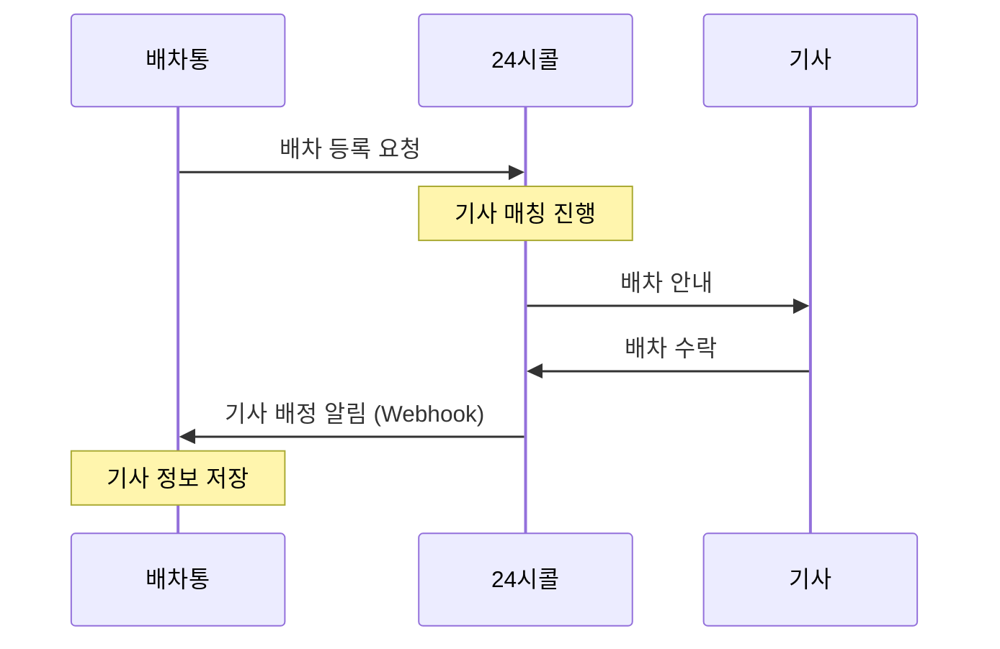
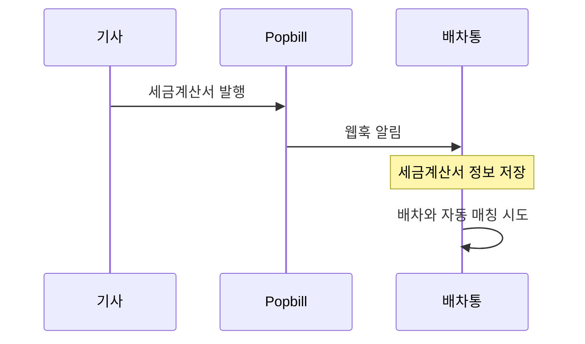

# 외부 연동 기능

배차통이 연동하는 외부 시스템과 그 기능을 설명합니다.

---

## 연동 시스템 개요

| 시스템 | 용도 | 연동 방식 |
|--------|------|----------|
| **24시콜** | 기사 매칭 | API 양방향 |
| **Popbill** | 세금계산서 | SDK |
| **네이버 지도** | 거리 계산 | REST API |
| **알리고** | SMS/카카오톡 | REST API |
| **유니패스** | 통관 정보 | REST API |
| **Slack** | 내부 알림 | Webhook |
| **AWS S3** | 파일 저장 | SDK |

---

## 1. 24시콜 연동

외부 배차 플랫폼과 연동하여 기사 매칭을 확대합니다.

### 연동 목적

- 자체 기사 네트워크 외 추가 기사 확보
- 자동 기사 매칭
- 배차 효율 향상

### 연동 흐름



### 주요 기능

| 기능 | 설명 |
|------|------|
| 배차 등록 | 24시콜에 배차 정보 전송 |
| 기사 매칭 수신 | 배정된 기사 정보 수신 |
| 상태 동기화 | 배차 상태 양방향 동기화 |
| 배차 취소 | 24시콜 등록 취소 |

### 전송 정보

| 항목 | 설명 |
|------|------|
| 상/하차 정보 | 출발/도착 주소, 연락처 |
| 화물 정보 | 상차품명, 무게 |
| 차량 정보 | 차종, 톤수 |
| 운임 정보 | 기사 운임 |

### 수신 정보 (기사 배정 시)

| 항목 | 설명 |
|------|------|
| 기사명 | 배정된 기사 이름 |
| 연락처 | 기사 전화번호 |
| 차량번호 | 기사 차량 번호 |

### 자동 동기화

- 주기적 상태 확인 (2분 간격)
- 취소된 배차 자동 제거
- 배정 정보 자동 업데이트

---

## 2. Popbill 세금계산서

전자세금계산서 발행 및 수신을 처리합니다.

### 연동 목적

- 세금계산서 자동 발행
- 세금계산서 자동 수신 (매입)
- 국세청 전송 자동화

### 주요 기능

#### 매출 세금계산서 (발행)

| 기능 | 설명 |
|------|------|
| 세금계산서 발행 | 화주에게 세금계산서 발행 |
| 발행 목록 조회 | 발행 내역 확인 |
| 발행 취소 | 세금계산서 취소 |

#### 매입 세금계산서 (수신)

| 기능 | 설명 |
|------|------|
| 웹훅 수신 | 신규 세금계산서 알림 |
| 자동 매칭 | 배차와 자동 연결 |
| 승인/거절 | 수동 처리 |

### 발행 정보

| 항목 | 설명 |
|------|------|
| 공급자 | 바른물류연구소 |
| 공급받는자 | 거래처 정보 |
| 작성일자 | 세금계산서 작성일 |
| 공급가액 | 세금 제외 금액 |
| 세액 | 부가세 |
| 품목 | 운송료 |

### 웹훅 처리

기사가 세금계산서를 발행하면 Popbill에서 웹훅으로 알려줍니다:



---

## 3. 네이버 지도 API

거리, 시간, 통행료를 계산합니다.

### 연동 목적

- 정확한 거리 계산
- 예상 소요 시간 산출
- 고속도로 통행료 계산

### 사용 기능

| 기능 | 설명 |
|------|------|
| Direction 5 | 경로 탐색 API |

### 요청 정보

| 항목 | 설명 |
|------|------|
| 출발 좌표 | 상차지 위도/경도 |
| 도착 좌표 | 하차지 위도/경도 |

### 응답 정보

| 항목 | 설명 |
|------|------|
| 거리 | 총 거리 (km) |
| 시간 | 예상 소요 시간 (분) |
| 통행료 | 고속도로 요금 (원) |

### 활용

- 배차 요청 시 자동 거리 계산
- 운임 산정 기준
- 거래처별 단가표 적용

---

## 4. 알리고 (Aligo)

SMS와 카카오 알림톡을 발송합니다.

### 연동 목적

- 기사에게 배차 안내
- 지급 예정 알림
- 각종 알림 발송

### SMS 발송

| 항목 | 설명 |
|------|------|
| 발신번호 | 바른물류연구소 대표번호 |
| 수신번호 | 기사 연락처 |
| 내용 | 배차 안내 등 |

### 카카오 알림톡

| 항목 | 설명 |
|------|------|
| 발신 프로필 | 바른물류연구소 |
| 템플릿 | 미리 등록된 메시지 형식 |
| 수신자 | 기사 카카오톡 |

### 알림톡 템플릿

| 코드 | 용도 | 내용 |
|------|------|------|
| TS_7744 | 지급 예정 | 입금일, 금액, 공제내역, 계좌 |

---

## 5. 유니패스 (Unipass)

관세청 통관 정보를 조회합니다.

### 연동 목적

- 수출입 화물 통관 정보 조회
- 반출 신고 정보 확인

### 조회 정보

| 항목 | 설명 |
|------|------|
| 반출자명 | 화물 반출자 |
| 연락처 | 반출자 전화번호 |
| 주소 | 반출지 주소 |
| 팩스 | 반출자 팩스 |

### 활용

- 수출입 배차 시 통관 정보 자동 조회
- 관련 서류 연계

---

## 6. Slack

내부 팀 알림을 발송합니다.

### 연동 목적

- 실시간 업무 알림
- 팀 간 정보 공유

### 알림 유형

| 이벤트 | 채널 | 내용 |
|--------|------|------|
| 신규 배차 | 신규오더 | 새 배차 등록 알림 |
| 배차 취소 | 취소 | 배차 취소 알림 |
| 빠른 지급 | 지급 | 익일 지급 요청 |

### 알림 형식

```
🚛 새 배차가 등록되었습니다

배차번호: #1001
거래처: (주)한국물류
상차지: 인천항 → 하차지: 서울
...
```

---

## 7. AWS S3

파일(이미지, 서류)을 저장합니다.

### 연동 목적

- 화물 이미지 저장
- 인수증 이미지 저장
- 계약서, 서류 저장

### 저장 파일 유형

| 유형 | 설명 |
|------|------|
| 화물 이미지 | 상차품 사진 |
| 인수증 | 인수 확인 서류 |
| 통관 서류 | IC, DO, PL 등 |
| 계약 서류 | 사업자등록증, 계약서 |

---

## 연동 관리

### 설정 정보

각 연동 시스템별로 필요한 설정:

| 시스템 | 설정 항목 |
|--------|----------|
| 24시콜 | API URL, 암호화 키 |
| Popbill | 링크 ID, 비밀키 |
| 네이버 지도 | Client ID, Secret |
| 알리고 | API Key, 발신번호 |
| Slack | Webhook URL (채널별) |
| AWS S3 | Access Key, Secret, Bucket |

### 오류 처리

연동 실패 시:
- 오류 로그 기록
- 관리자 알림 (선택적)
- 재시도 정책은 시스템별 상이

---

## 관련 문서

- [시스템 구조](../01-overview/architecture.md) - 전체 구조
- [배차 워크플로우](../03-workflow/dispatch-flow.md) - 24시콜 연동 흐름
- [청구/정산 워크플로우](../03-workflow/billing-flow.md) - Popbill 연동 흐름
- [알림 체계](../03-workflow/notification-flow.md) - 알리고, Slack 상세
